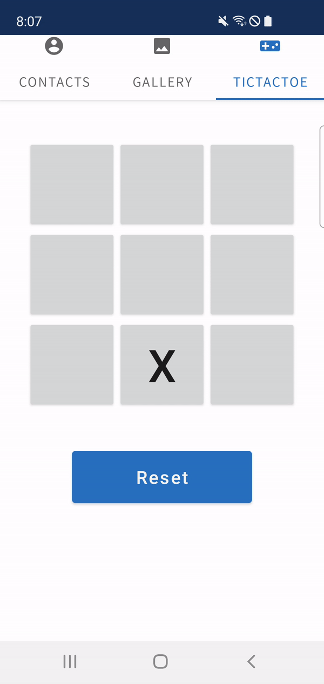

# 몰입캠프 1주차

Simple overview of use/purpose.

김성준, 정강산

# TAB 1 - 연락처

<p align="center"></p>

# TAB 2 - 갤러리

<p align="center"></p>

## **Tech Stack**

- Android Cursor를 이용하여 휴대전화 내부 이미지를 가져온다.
- 다앙한 크기의 cell을 구성하기 위해 TableLayout이 아닌 중첩된 LinearLayout을 사용한다.
- 이미지 비율을 유지한 갤러리 구성을 보여준다.

```java
Queue<String> imageList = ...

while (imageList.size() > 0) {
    double ratio1 = (double)bitmap1.getWidth() / bitmap1.getHeight();
    ...
    double ratio2 = (double)bitmap2.getWidth() / bitmap2.getHeight();

    // ratio1 과 ratio2를 비교, 적절한 배치를 결정
}

```

- 앱 시작 시 비동기적으로 휴대폰 저장소의 이미지를 가져온다.

```java
private class SetImageTask extends AsyncTask<Object, Void, Boolean> {
    private Queue<String> imagePaths;
    ...

    @Override
    // Set thread
    protected Boolean doInBackground(Object... params) {
        ...
        setImages(mRootView, imagePaths);
        return true;
    }

    @Override
    // Called when task done
    protected void onPostExecute(Boolean aBoolean) {
        super.onPostExecute(aBoolean);
        ...
    }
```

## **최적화 이슈**

자원이 큰 이미지들을 사용하기 때문에 느리다.

<해결책>

1. 이미지 리사이즈 (구현)

```java
Bitmap resizedBitmap = Bitmap.createScaledBitmap(bitmap, width, height, false);
```

2. 현재 보이는 이미지들과 주변 이미지들만 캐싱 (미구현)

# TAB 3 - 틱택토 게임

<p align="center"></p>

- [MiniMax](https://en.wikipedia.org/wiki/Minimax)

# 배운점

```java
if (StackOverflow == null || Google == null)
    throw new BrainMeltdownException();
```

- 커뮤니케이션을 통해 서로 부족한 점과 배운 점을 효과적으로 공유할 수 있다.
- 프로젝트 방향성에 대한 충분한 논의를 한 뒤에, 프로젝트에 돌입하자. **(방향성을 중간에 바꾸려면 오버헤드가 너무 크다!)**
