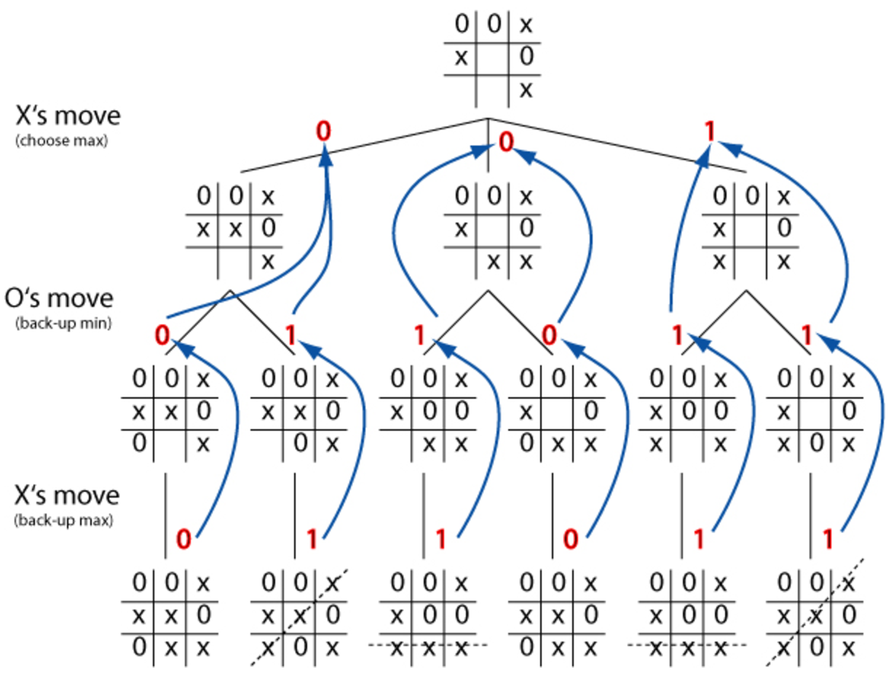

# 몰입캠프 1주차
## 프로젝트 내용
### 공통과제 I (12/28 ~ 1/4) - 탭 구조를 활용한 안드로이드 앱 제작
- 프로젝트 구성원: [김성준](https://github.com/sjwhole), [정강산](https://github.com/sanu7d0)

<br/>

# Switch between tabs - ViewPager
```java
ViewPage viewPager = binding.viewPager;
viewPager.setAapter(sectionPagerAdapter);
...
public class SectionsPagerAdapter extends FragmentPagerAdapter{
    ...
}
```
ViewPager를 통해 각 탭(**Fragment**)간의 전환을 구현했다.

# TAB 1 - 연락처

<p align="center"></p>

### 연락처 불러오기
```java
Cursor cursor = context.getContentResolver().query(uri, projection, null, null, sortOrder);
...
ListView listView = (ListView) rootView.findViewById(R.id.list);
listView.setAdapter(adapter);
```
- Android cursor을 이용하여 휴대전화 내부 연락처를 불러온다.
- ListView를 사용하여 각 연락처를 보여준다.

<br/>

### 전화 걸기
```java
((ImageButton) viewPhone.findViewById(R.id.call)).setOnClickListener(view -> {
    Intent callIntent = new Intent(Intent.ACTION_CALL);
    callIntent.setData(Uri.parse("tel:" + phone.getNum()));
    context.startActivity(callIntent);
});
```
- Button의 setOnClick를 사용하여 전화 버튼 Listen
- Indent를 통해 전화버튼를 누를 시 전화 Activity를 전환한다.

<br/>

### 전화번호 추가
```java
rootView.findViewById(R.id.add_contact).setOnClickListener(
            view -> {
                AlertDialog.Builder builder = new AlertDialog.Builder(context);
                builder.setTitle("전화번호 추가하기");
                ...
```
- FloatingActionButton버튼을 통해 전화번호 추가 Listen
- Indent를 통해 전화번호 저장을 누를 시 연락처 Activity를 전환한다.

<br/>

### 전화번호 검색
```java
SearchView searchView = (SearchView) rootView.findViewById(R.id.searchContact);
        searchView.setOnQueryTextListener(new SearchView.OnQueryTextListener() {
            @Override
            public boolean onQueryTextSubmit(String query) {
                ...
            }
```
- SearchView를 사용하여 setOnQueryTextListener를 통해 검색어를 가져온다.
- 해당 검색어를 통해 이름과 일치하는 사람 찾아준다.

# TAB 2 - 갤러리

<p align="center"></p>

## **Tech Stack**

- Android Cursor를 이용하여 휴대전화 내부 이미지를 가져온다.
- 다앙한 크기의 cell을 구성하기 위해 TableLayout이 아닌 중첩된 LinearLayout을 사용한다.
- 이미지 비율을 유지한 갤러리 구성을 보여준다.

```java
Queue<String> imageList = ...

while (imageList.size() > 0) {
    double ratio1 = (double)bitmap1.getWidth() / bitmap1.getHeight();
    ...
    double ratio2 = (double)bitmap2.getWidth() / bitmap2.getHeight();

    // ratio1 과 ratio2를 비교, 적절한 배치를 결정
}

```

- 앱 시작 시 비동기적으로 휴대폰 저장소의 이미지를 가져온다.

```java
private class SetImageTask extends AsyncTask<Object, Void, Boolean> {
    private Queue<String> imagePaths;
    ...

    @Override
    // Set thread
    protected Boolean doInBackground(Object... params) {
        ...
        setImages(mRootView, imagePaths);
        return true;
    }

    @Override
    // Called when task done
    protected void onPostExecute(Boolean aBoolean) {
        super.onPostExecute(aBoolean);
        ...
    }
```

## **최적화 이슈**

자원이 큰 이미지들을 사용하기 때문에 느리다.

<해결책>

1. 이미지 리사이즈 (구현)

```java
Bitmap resizedBitmap = Bitmap.createScaledBitmap(bitmap, width, height, false);
```

2. 현재 보이는 이미지들과 주변 이미지들만 캐싱 (미구현)

# TAB 3 - 틱택토 게임

<p align="center"></p>

```java
for (int i = 0; i < 3; i++) {
            for (int j = 0; j < 3; j++) {
                buttons[i][j] = new Button(getActivity());
                Button button = buttons[i][j];
                button.setLayoutParams(new LinearLayout.LayoutParams(300, 300));
                button.setTextSize(50);
                ...
                buttonGrid.addView(button);
```
- GridLayout과 Button을 통해 TicTacToe 게임을 구현했다.
- Button에 setOnClickListener를 사용하여 사용자 선택을 Listen.

<br/>

<p align="center"></p>

- [MiniMax](https://en.wikipedia.org/wiki/Minimax) 알고리즘을 이용하여 컴퓨터가 둘 수를 계산한다. **(컴퓨터는 절대 지지 않음!)**

# 배운점

```java
if (StackOverflow == null || Google == null)
    throw new BrainMeltdownException();
```

- 커뮤니케이션을 통해 서로 부족한 점과 배운 점을 효과적으로 공유할 수 있다.
- 프로젝트 방향성에 대한 충분한 논의를 한 뒤에, 프로젝트에 돌입하자. **(방향성을 중간에 바꾸려면 오버헤드가 너무 크다!)**
