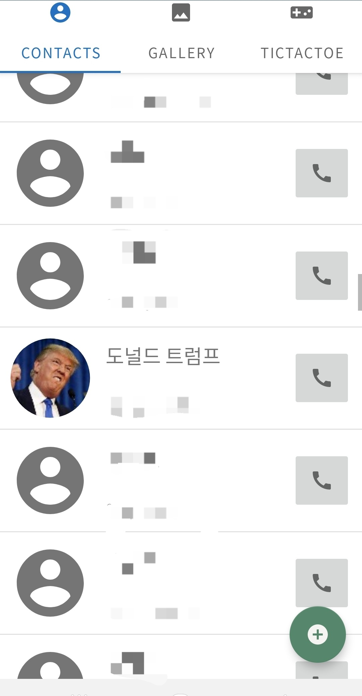
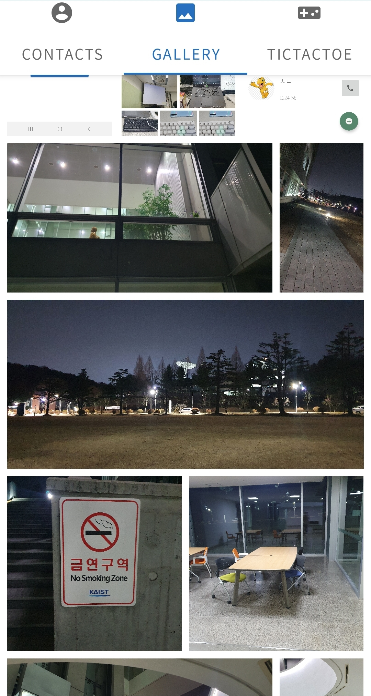
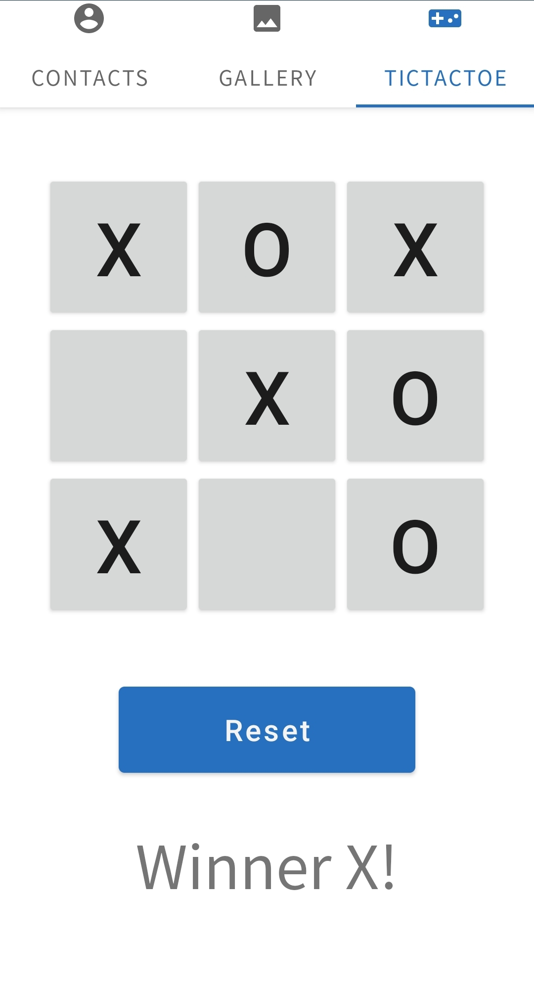

# 몰입캠프 1주차

Simple overview of use/purpose.

김성준, 정강산

## Description

An in-depth paragraph about your project and overview of use.

## Getting Started

### Dependencies

- Describe any prerequisites, libraries, OS version, etc., needed before installing program.
- ex. Windows 10

### Installing

- How/where to download your program
- Any modifications needed to be made to files/folders

### Executing program

- How to run the program
- Step-by-step bullets

```
code blocks for commands
```

## Help

Any advise for common problems or issues.

```
command to run if program contains helper info
```

## Authors

Contributors names and contact info

ex. Dominique Pizzie  
ex. [@DomPizzie](https://twitter.com/dompizzie)

## Version History

- 0.2
  - Various bug fixes and optimizations
  - See [commit change]() or See [release history]()
- 0.1
  - Initial Release

## License

This project is licensed under the [NAME HERE] License - see the LICENSE.md file for details

## Acknowledgments

Inspiration, code snippets, etc.

- [awesome-readme](https://github.com/matiassingers/awesome-readme)
- [PurpleBooth](https://gist.github.com/PurpleBooth/109311bb0361f32d87a2)
- [dbader](https://github.com/dbader/readme-template)
- [zenorocha](https://gist.github.com/zenorocha/4526327)
- [fvcproductions](https://gist.github.com/fvcproductions/1bfc2d4aecb01a834b46)
- [MiniMax](https://en.wikipedia.org/wiki/Minimax)

## TAB 1 - 연락처


ㅁㅁㅁ

## TAB 2 - 갤러리



- AsyncTask 클래스 이용 -> 비동기적으로 갤러리의 이미지들을 로드한다.
- 이미지의 비율을 유지한 갤러리 구성을 보여준다

## TAB 3 - 틱택토 게임



ㅁㅁ
ㅁ
